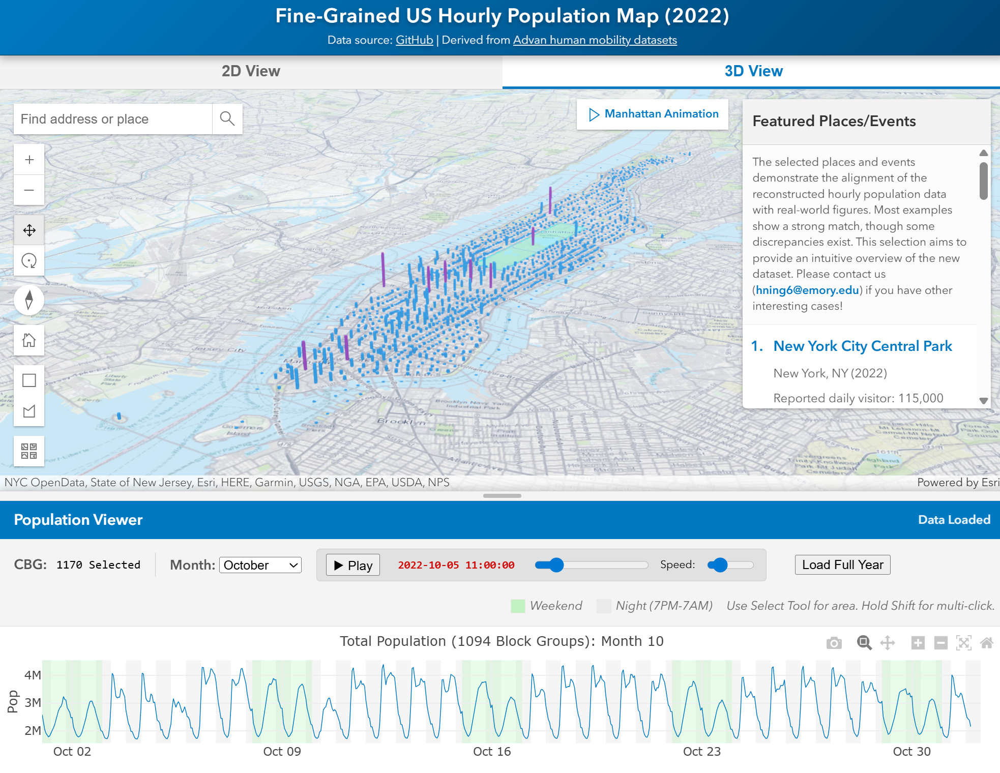

# Hourly population dataset

We are excited to share the first large-scale fine-grained hourly population dataset (per our knowledge😊)! This dataset contains dynamic populations of all United States' 220,000 neighborhoods (Census block groups) for 8,760 hours in 2022. In other words, a population map for each hour, and 8,760 maps in total! We compared the hourly population with reported or estimated visitor counts in 11 events or places, and the matchness is promissing. 

More details can be found in our paper "Nationwide Hourly Population Estimating at the Neighborhood Scale in the United States Using Stable-Attendance Anchor  Calibration". The paper will be released soon! We expect the proposed statistical approach would be widely used to estimate dynamic population in the further. Millions of thanks for the research team: Huan Ning, Zhenlong Li, Manzhu Yu, Xiao Huang, Shiyan Zhang, and Shan Qiao! 

This product has a lot of applications, such as environmental exposure assessment, emergency response, and social resilience analysis. This study is based on the human mobility big data derived from smartphone ping data, released by [Advan Research](https://docs.deweydata.io/docs/advan-research).

Please contact the research team for any questions.

# Visualization website:
We strongly recommend you to use this website to take a look at the dataset! You can select any neighorhoods (Census block groups) to check their hourly populations and find interesting cases. For example, please check the local festivals your know, or the hot seasons of attractives. 3D animation is also 
supported! 

Site link: [Fine-Grained US Hourly Population Map (2022)](https://gladcolor.github.io/hourly_population)

 
<video src="https://github.com/user-attachments/assets/1dcef656-7ac8-4ab3-8e26-c6fb47b1bcc9" width="100px" controls></video> 

# Link of dataset
Link at Huggingface: [hourly_population_US](https://huggingface.co/datasets/gladcolor/hourly_population_US)

The dataset contains hourly population for each US Census block groups in 2022, organized by county-month. 

# Sourcecode file usage
## Data preprocessing
`CSV_to_parpuet.ipynb`: Convert the Adan CSV data files to parquet files, which is more efficient for data processing.

## Data analysis
`show_school_hourly.ipynb`: Show the stable-attendance windows of high school POIs.

`show_school_hourly.py`: Process all schools, and save the detected stable-attendance windows. 

`county_visit_scaling_factor.ipynb`: Compose the school-weekly observation scaling factor to county-monthly factor.

`hourly_population_20251215.ipynb`: Generate houlry inbound, outbound, and dynamic population. 

`Floating_population20151220.ipynb`: Generate hourly population plots and maps.

`Compare_LandScan.ipynb`: Compare hourly results with LandScan data.

`Remove_negative.ipynb`: Remove the negative population CBG-hour cells. About 2% cell will have large estiamted outbounds, we set the cell as the a minimal value (10% of the ACS population), while redraw the outbound in the destinations. Need a further investigation for these large outbound and a better solution. 

## Supporting files
These contains functions for Jupyter notebooks. 

`helper.py`: data processing functions.

`Advan_operation.py`: functions to process Advan data.

# To do

- Investigation of large outbounds (negative hourly population), probably due to IPF without constraints, outdated Census baseline data, and inappropriate origin device distribution. 
- Use different origin distributions, e.g., weekday, weekend, lunch time, dinner time...
- Collect more dynamic population benchmarks to assess the hourly population. 
- Comprehensive understanding of the estimated hourly population.

